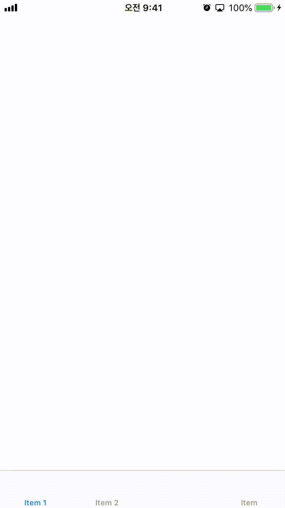

# Swift-Popup-in-Tabbar



**English translation is under the Korean sentences**  
Tabbar에서 뷰가 팝업되는 효과를 구현하고 싶었으나.. 적절한 라이브러리나 예제를 찾기 힘들었습니다😭  
그래서 저는 구글링과 삽질 끝에 Tabbar에도 팝업 효과의 뷰를 구현하는 방법을 찾았습니다!!  
다른 분들은 저 처럼 고생하지 않도록 예제 프로젝트와 함께 사용 방법을 정리해봤습니다😊   

*잘못된 코드, 내용 등은 __이슈__ 남겨주시면 수정하겠습니당:)*
<!--Tabbar에서 tab이 선택되었을 때 Popup뷰를 띄우는 방법을 정리했습니다 :)  -->

### 솔루션 Solution
먼저 Tabbar와 UIViewController를 Relationship Segue로 연결해줍니다. 예제를 보면 Storyboard Reference를 이용한 방법과 디폴트 방법 두가지 케이스 모두 확인할 수 있습니다.      
**First connect Tabbar and UIViewController using Relationship Segue. You can see the two way in the example**        

`AppDelegate`에 `UITabBarControllerDelegate`를 추가해줍니다. 그리고 아래의 함수를 사용합니다.     
**Add `UITabBarControllerDelegate` in `AppDelegate`. And use the `func tabBarController` which is same with sample code**     

```
func tabBarController(_ tabBarController: UITabBarController, shouldSelect viewController: UIViewController) -> Bool {
        if viewController is PopupViewController {
            if let popupView = tabBarController.storyboard?.instantiateViewController(withIdentifier: "Popup") {
                tabBarController.present(popupView, animated: true)
                return false
            }
            return false
        }
        return true
    }

```

상속받은 `tabBarController`속에서 팝업할 뷰의 컨트롤러를 Identfier로 연결합니다. 그리고 tabBarController.present를 통해 해당 뷰가 보여질 수 있도록 합니다.    
**In `tabBarController` connect view as Identifier which will popup. And using tabBarController.present, do that view can visable**        

다음으로 가장 먼저 실행될 뷰컨트롤러에 `UITabBarControllerDelegate`를 추가합니다.     
**Add `UITabBarControllerDelegate` to the View which is loaded at first**    
```
class FirstViewController: UIViewController , UITabBarControllerDelegate{
```
그리고 해당 클래스속 `viewDidLoad()`에 아래의 코드를 추가합니다.     
**and add code in the `viewDidLoad()` to that View**        
```
self.tabBarController?.delegate = UIApplication.shared.delegate as? UITabBarControllerDelegate
```

#### StoryBoard
팝업뷰로 쓰고싶은 UIViewController의 background color를 제거해줍니다. 이와 함께 Presentation 스타일을 **Over Current Context**로 해줍니다      
**Remove the background color in the UIViewController which is used for popup view**     
**Also, Change the Presentation style as Over Current Context**       

### 한계점
팝업된 뷰가 최상단에 있는 상태에선, 하단의 Tabbar를 쓸 수 없는 문제점이 있습니다. 따라서 뷰를 dismiss할 추가의 액션을 예제코드에 넣어두었습니다.   
혹시라도 좋은 해법이 떠오른다면 이슈나 MR남겨주시면 감사하겠습니다🙂

